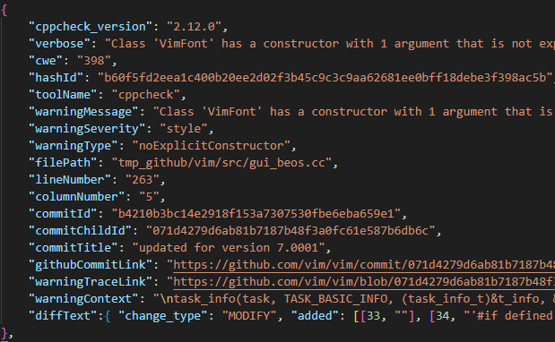

# Description
[](https://zenodo.org/doi/10.5281/zenodo.10277281)

# Dataset Details
- Generated_raw_data: A directory containing the raw data generated by mining.
- SAMiner.jar: Tools for mining raw Dataset
- Script_preprocess.py: Pre-processing scripts for datasets for tracing warnings.
- requirements.txt: requirements for python.
- compressed_ActionableWarning.json.gz: Merged json file using gzip compression, generated via Script_preprocess.py
- ...

# Usage Example
- `git clone https://github.com/LiuZhipeng99/AW4C.git`


```
import pandas as pd
# Read the compressed JSON file
df = pd.read_json("test_compressed_ActionableWarning.json.gz", compression='gzip')
# Use the dataframe as needed
```

- Screenshots




# Steps to Reproduce
## Dependencies
- Git
- Python 3
- Java 17
- Tools for mining： https://github.com/LiuZhipeng99/AWMiner

## TODO
- Finish readme
- Optimized incremental analysis algorithm for cppcheck special field "Info"
- Update datasource files
